# Store-Management-Dashboard

A modern, responsive online clothing store built with React. Explore products, add to cart, and manage your store via a full-featured admin dashboard.

🔗 Live Demo: https://react-ecommerce-clothing-store.onrender.com/

---

## ⚙️ Tech Stack

- **Frontend:** React, React Router
- **Styling:** Tailwind CSS, ShadCN, RadixUI, Framer Motion, MaterialUI 
- **Global State Managment:** Zustand
- **Data Fetching & Rendering Optimization:** Axios, React Query, TanStack Table

- **Backend:** Node.js, Express, Cloudinary, Stripe
- **Auth:** JWT, bcrypt  
- **Database:** PostgreSQL (hosted on Neon), Redis (hosted on Upstash)

- **DevOps & Deployment (Docker, NGINX):**
  - Dockerized full-stack app with separate containers for frontend and backend, hosted on different domains
  - Frontend served via NGINX for optimal performance and caching
  - Production build and Docker/NGINX setup details can be found on the production branch
  - Docker Compose is used for local development only

---

## ⚙️ Database Schema

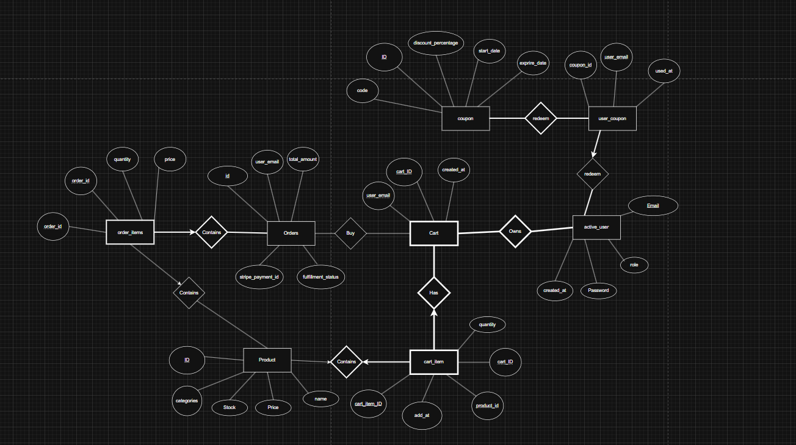 

---

## 📸 Screenshots

Here are some screenshots available for our current website

### Landing Page
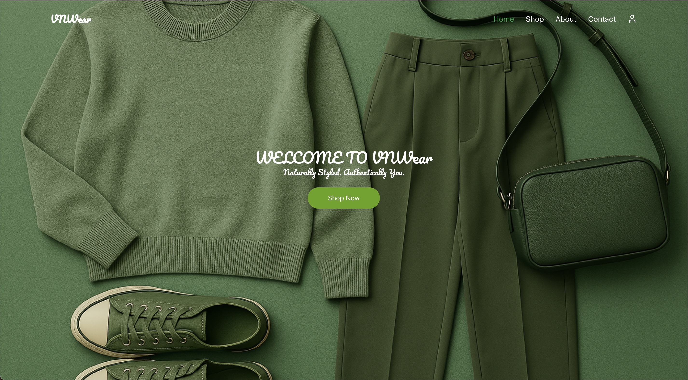  
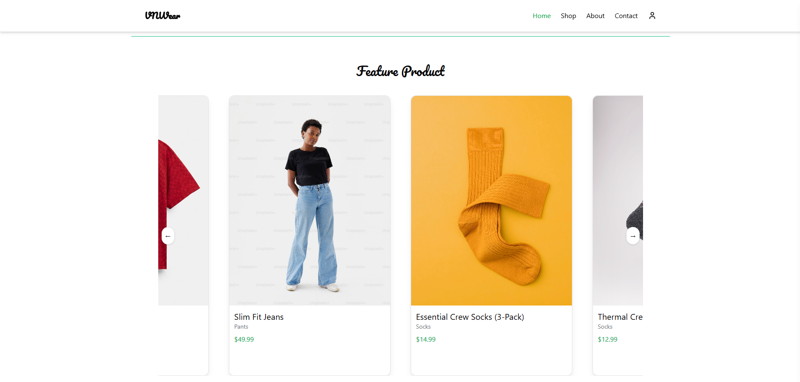
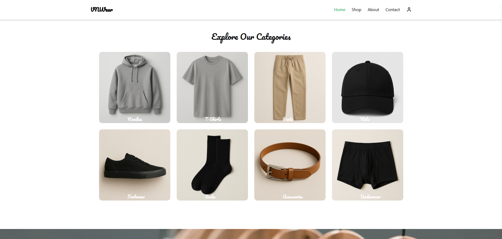
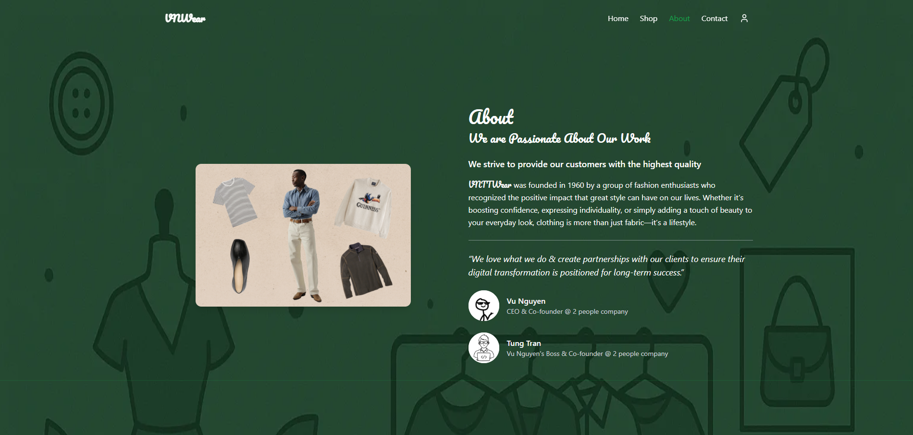
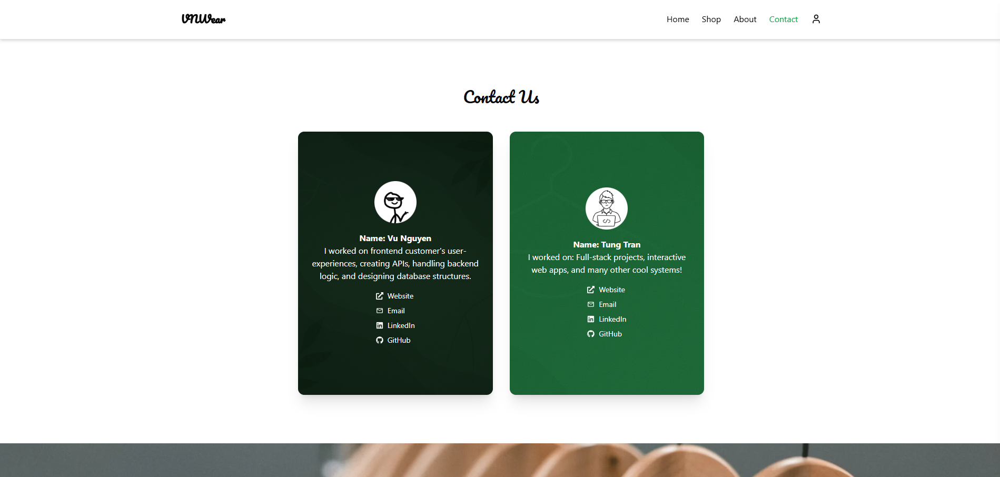

### Product Listing
  

### Shopping Experience
  
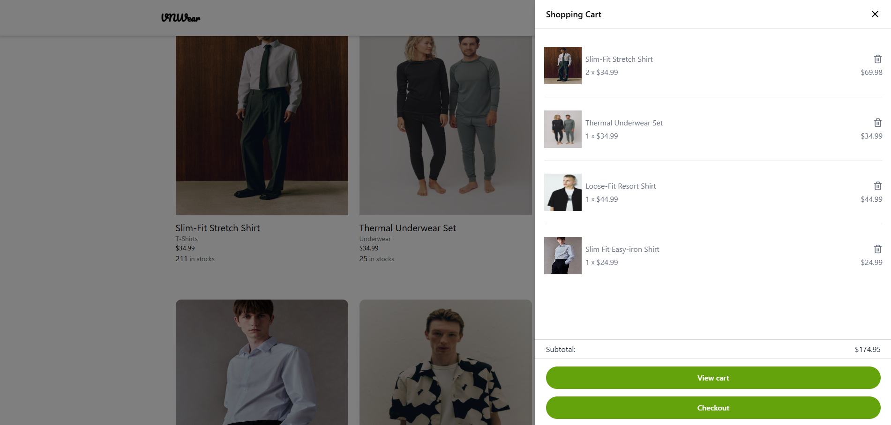  
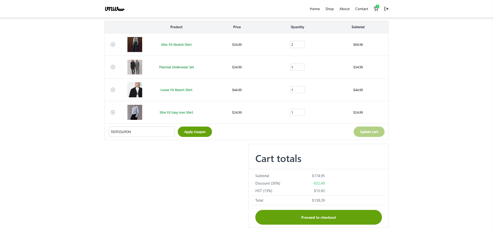
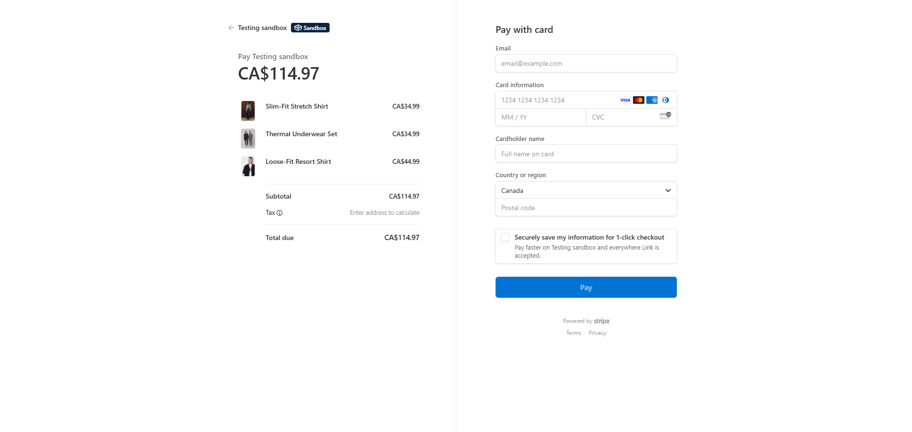
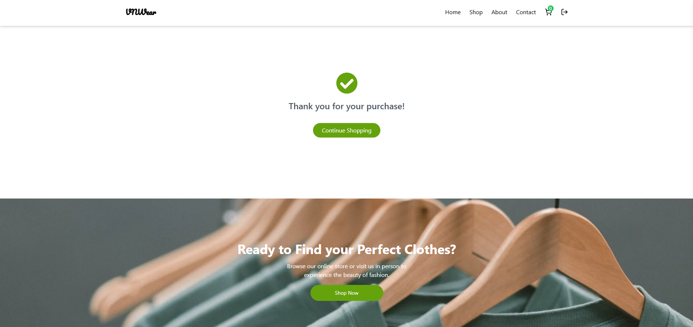

### Smooth Login with Animation
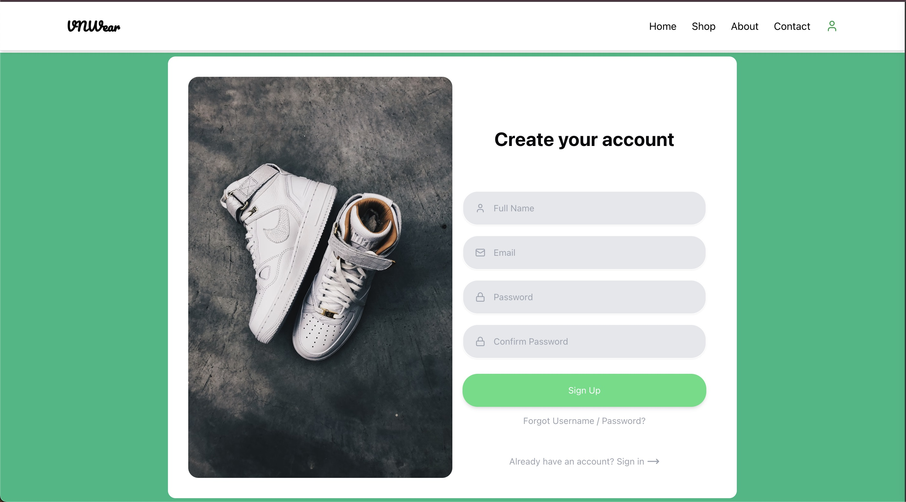  
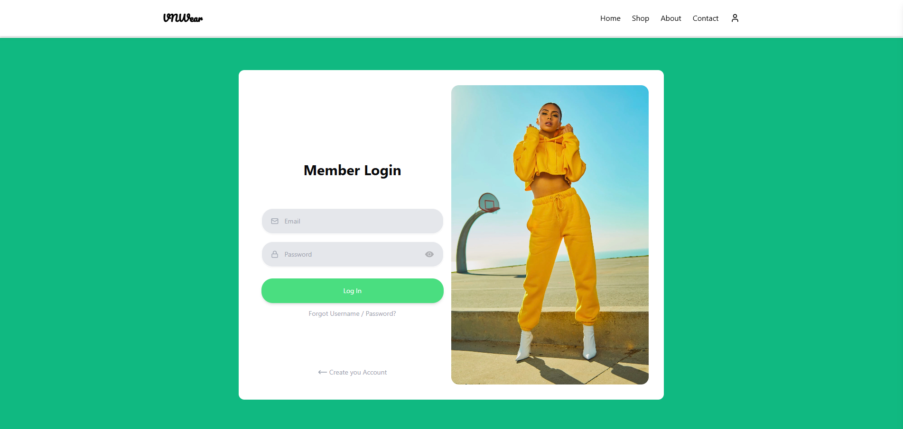

### Admin Product Management Page
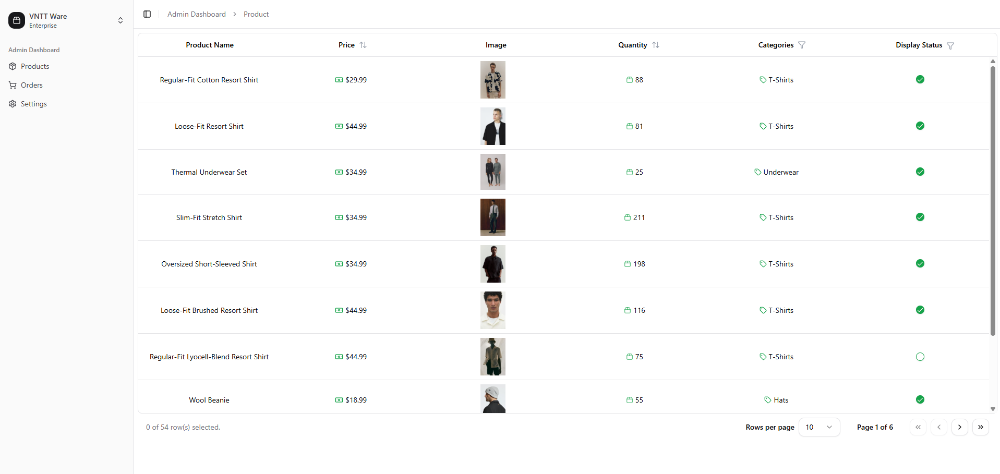

### Admin Orders Management Page
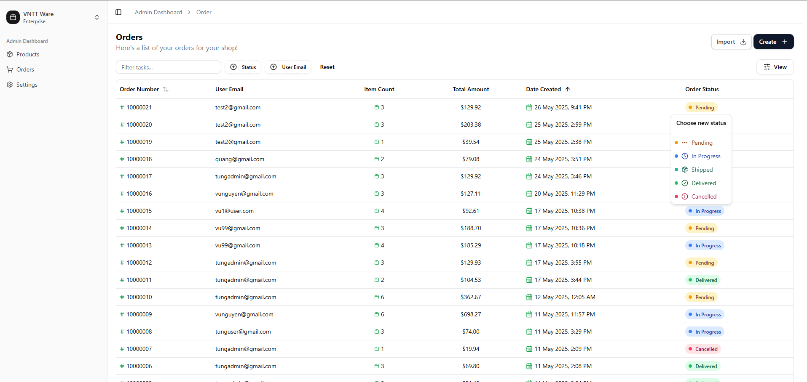

---

## 🛠️ Features

### Admin Features
- **Clean, Responsive Landing Page**  
  Highlight your brand with a minimalist design.
- **Product Mangement**  
- **Shopping Cart & Checkout**  
  Intuitive cart management and step-by-step checkout flow.
- **Animated Authentication**  
  Engaging login/register screens powered by Framer Motion.

### Admin
- **Full Admin Dashboard**  
  Manage products, orders, and users from one place.
- **Category Filters & Sorting**  
  Quickly find and organize products.
- **Toggle Product Visibility**  

## 📦 Installation with Docker
# 1. Clone the repo
git clone https://github.com/your-username/react-ecommerce-clothing-store.git
cd react-ecommerce-clothing-store

# 2. Run docker compose
docker compose watch  # for developing and rebuild when detect changes 
