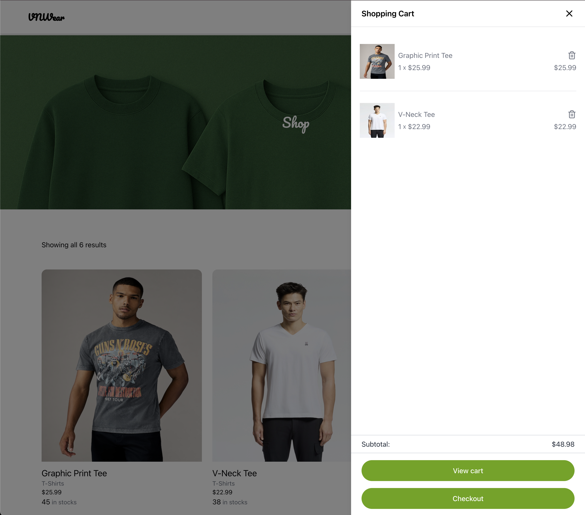
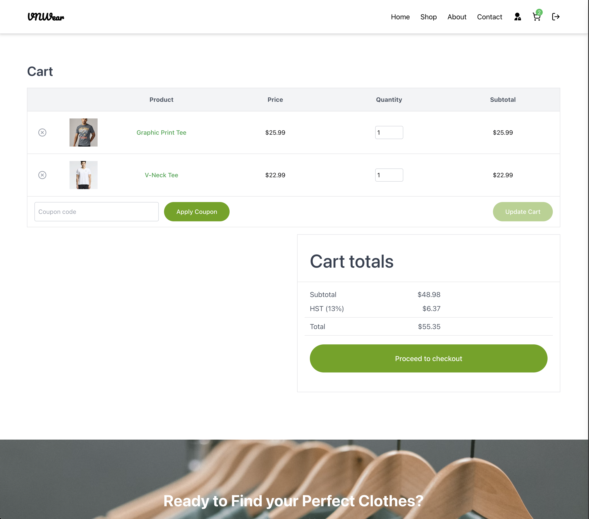
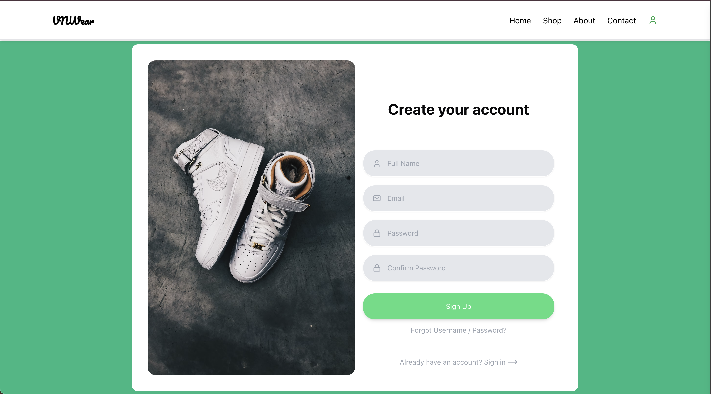
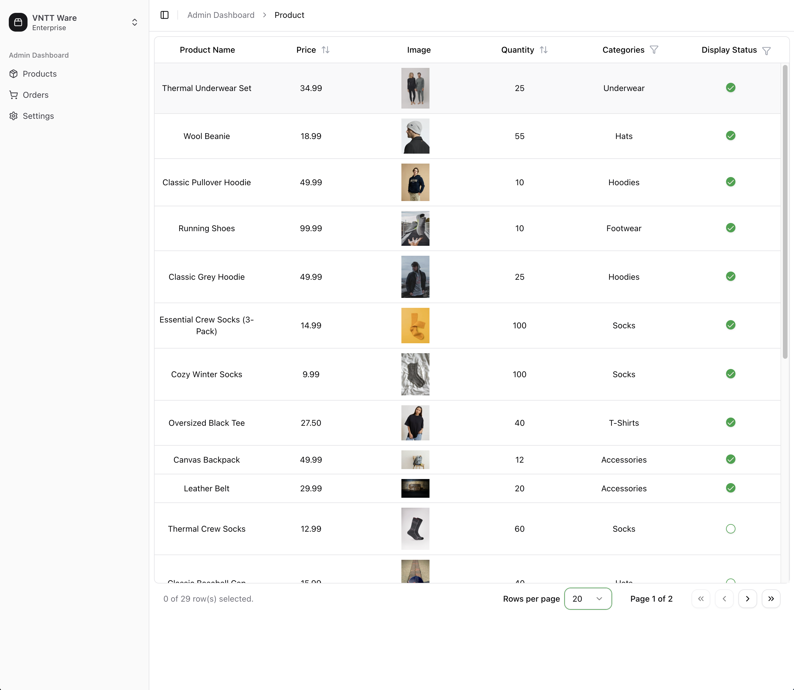
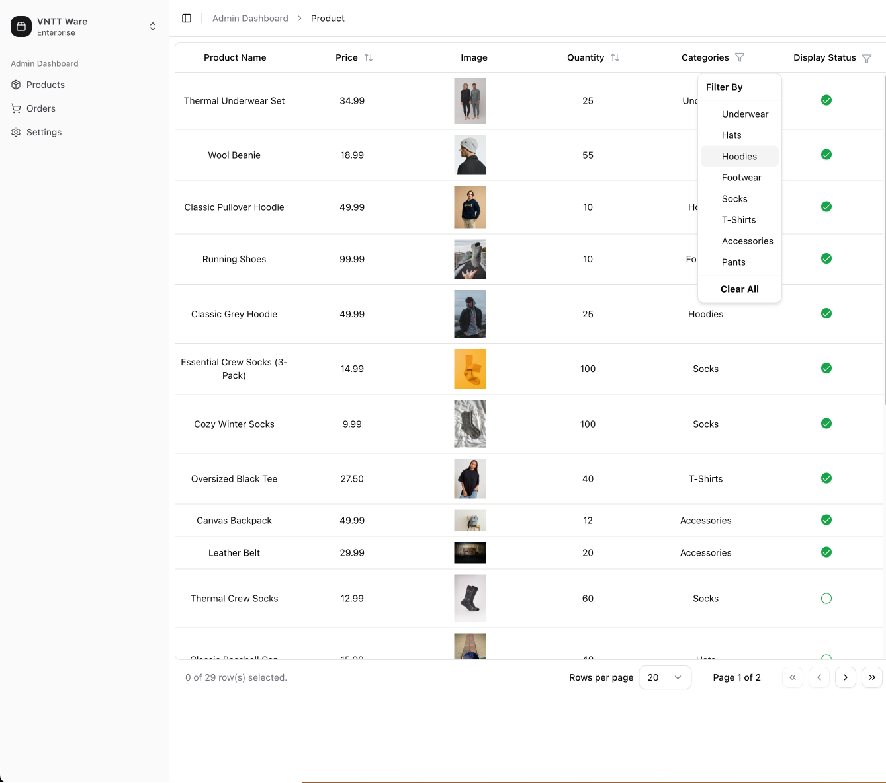
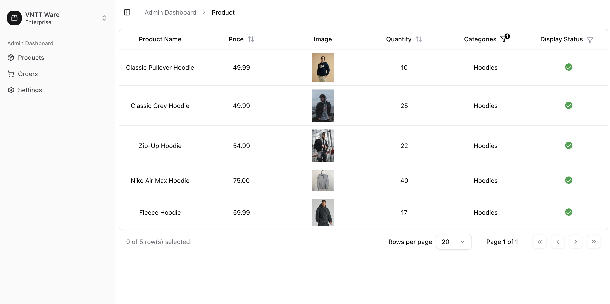
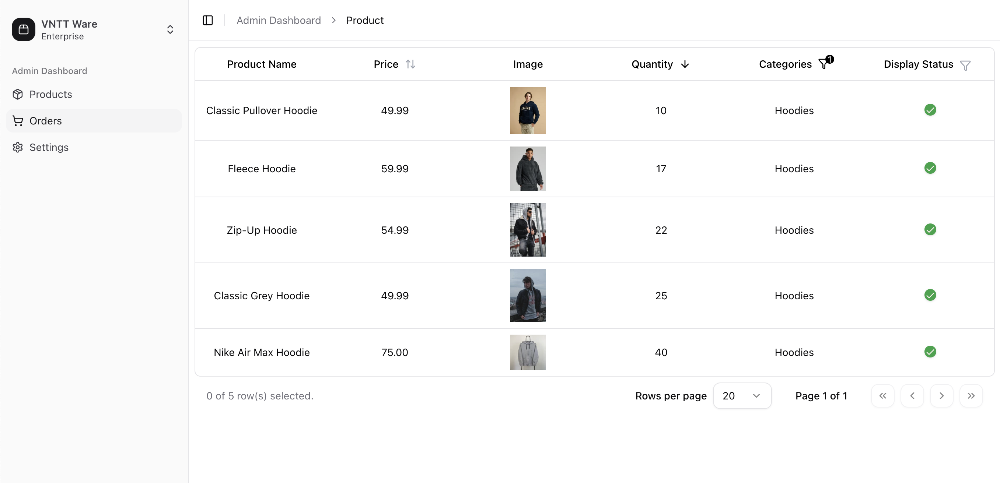

# React E-Commerce Clothing Store  
> Under Development

A modern, responsive online clothing store built with React. Explore products, add to cart, and manage your store via a full-featured admin dashboard.

---

## 📸 Screenshots

### Landing Page & Product Listing
  

  

### Shopping Experience
  
  


### Smooth Login with Animation
  


### Admin Product Dashboard


---

## 🛠️ Features

### Customer-Facing
- **Clean, Responsive Landing Page**  
  Highlight your brand with a minimalist design.
- **Product Mangement**  
  - Category filters  
      
    
  - Sort by price, popularity, or rating  
    
- **Shopping Cart & Checkout**  
  Intuitive cart management and step-by-step checkout flow.
- **Animated Authentication**  
  Engaging login/register screens powered by Framer Motion.

### Admin
- **Full Admin Dashboard**  
  Manage products, orders, and users from one place.
- **Category Filters & Sorting**  
  Quickly find and organize products.
- **Toggle Product Visibility**  
  - **Before:**   
  - **After:**  

---

## ⚙️ Tech Stack

- **Frontend:** React, React Router
- **Styling:** Tailwind CSS, Framer Motion  
- **Data Fetching:** React Query  
- **Auth:** JWT, bcrypt  
- **Backend (WIP):** Node.js, Express  
- **Database (WIP):** MongoDB (Mongoose)  

---

## 📦 Installation

```bash
# 1. Clone the repo
git clone https://github.com/your-username/react-ecommerce-clothing-store.git
cd react-ecommerce-clothing-store

# 2. Install dependencies
npm install

# 3. Start development server
npm run dev

# 4. Build for production
npm run build
npm start